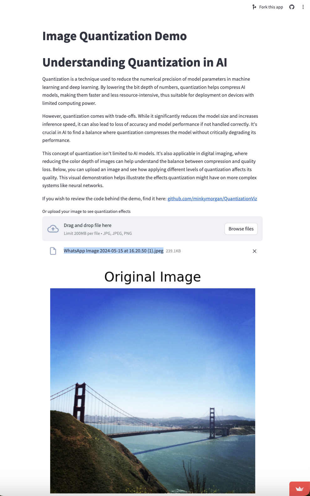

# QuantizationViz: Understanding Quantization and QLoRA

Welcome to QuantizationViz, an interactive web application designed to visually demonstrate the effects of image quantization and model adaptation using QLoRA (Quantized Low-Rank Adaptation). This tool helps users understand how quantization impacts image quality and AI model performance.

## Project Overview

QuantizationViz offers two primary applications:

1. **Image Quantization Demonstration**: Allows users to upload images and apply different levels of quantization to observe the resulting quality and compression.
2. **QLoRA Demonstration**: Illustrates the concept of QLoRA, showing how quantization and low-rank adaptation can be used to efficiently finetune large language models (LLMs).

### Why Quantization Matters

In the landscape of AI and machine learning, models are often published with various quantization levels, allowing them to be adapted for different hardware constraints and performance needs. However, the impact of these quantization levels on model performance and memory footprint is not widely understood. By visualizing how quantization affects digital images and model training, this application aims to provide a tangible understanding of these impacts, making it easier for users to appreciate the trade-offs involved in AI model compression.

## Live Demos

- [Image Quantization Live Demo](https://minkymorgan-qviz.streamlit.app/)
- [QLoRA Demonstration Live Demo](URL to your deployed QLoRA app)

## Image Quantization App

This application demonstrates the effects of image quantization by allowing users to upload images and apply different levels of quantization. Here are the key features:

1. **Image Upload**: Users can upload an image, which is then displayed as uploaded and resized.
2. **Quantization Levels**: The app converts the image to a numpy array and applies various levels of quantization, showing how the image degrades as the bit depth decreases.

The images reveal how quantization compresses the parameters in an AI model by _rounding_ values down from 16 bits to 8, 4, 2, and 1 bit. While this quantization process can speed up computation, some sacrifices in quality should be expected.

### Data Loss Study

This section illustrates the data loss that occurs with quantization. Cost reduction via quantization needs careful measurement and quality controls. Here are some examples of data lost in translation:

## QLoRA Demonstration App

This new addition to QuantizationViz explains and visualizes QLoRA, a technique used to efficiently finetune large language models. Key features include:

1. **Image Upload**: Users can upload two images - one representing the pre-trained model (e.g., Golden Gate Bridge) and another representing new data (e.g., Stonehenge).
2. **Quantization and Adaptation**: The app demonstrates how the images are quantized and then adapted using QLoRA, showing the effects on the final output.

### How QLoRA Works

1. **Quantization**: Reduces the precision of the model's parameters, lowering the memory and computational requirements. For example, converting 32-bit floating point numbers to 8-bit integers.
2. **Low-Rank Adaptation**: Instead of updating all parameters, it updates only a small, low-rank subset of them. This targeted update maintains performance while minimizing computational costs.

### Conclusion

QuantizationViz is designed to educate users about the balance between compression and quality in digital imaging and AI. By providing an intuitive understanding through direct interaction and visualization, this tool enhances comprehension of quantization effects in both digital imaging and artificial intelligence model compression.

Thank you for exploring QuantizationViz. We hope this tool enhances your understanding of quantization effects in both digital imaging and artificial intelligence model compression.

If you have any questions or need assistance, feel free to contact me at andrew.morgan(at)6point6.co.uk.

## Further Reading

For more detailed technical information on QLoRA and its applications, you can refer to the following resources:
- [GitHub - QLoRA](https://github.com/artidoro/qlora)
- [NeurIPS 2023 Paper](https://proceedings.neurips.cc/paper_files/paper/2023/hash/1feb87871436031bdc0f2beaa62a049b-Abstract-Conference.html)
- [arXiv - QLoRA Paper](https://arxiv.org/abs/2305.14314)
- [Papers With Code - QLoRA](https://paperswithcode.com/paper/qlora-efficient-finetuning-of-quantized-llms)

